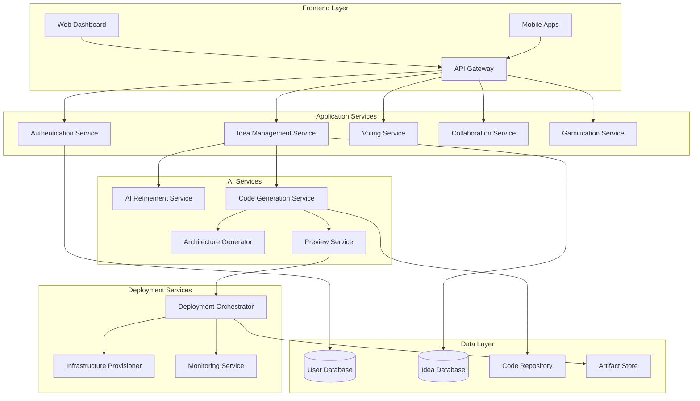

# Design Document

## Overview

IdeaForge is architected as a microservices-based platform that combines traditional idea management workflows with cutting-edge AI-powered code generation and deployment automation. The system uses a modular architecture to separate concerns between user management, idea processing, AI code generation, and deployment orchestration.

The platform leverages Large Language Models (LLMs) for code generation, containerization for deployment consistency, and cloud-native services for scalability. The architecture supports real-time collaboration, progressive web app capabilities, and cross-platform mobile development through React Native and Flutter integration.

## Architecture

### High-Level Architecture



### Technology Stack

**Frontend:**
- React.js with TypeScript for web dashboard
- React Native for cross-platform mobile apps
- Material-UI/Ant Design for consistent UI components
- WebSocket connections for real-time collaboration

**Backend Services:**
- Node.js with Express/Fastify for API services
- Python with FastAPI for AI services
- Go for high-performance deployment services
- GraphQL for flexible data querying

**AI/ML Stack:**
- OpenAI GPT-4/Claude for code generation
- Hugging Face Transformers for specialized models
- LangChain for AI workflow orchestration
- Vector databases (Pinecone/Weaviate) for code similarity search

**Infrastructure:**
- Kubernetes for container orchestration
- Docker for containerization
- AWS/GCP/Azure for cloud services
- Terraform for infrastructure as code
- GitHub Actions/GitLab CI for deployment pipelines

## Components and Interfaces

### Core Application Services

#### Authentication Service
- **Purpose**: Manages user authentication, authorization, and role-based access control
- **Key Methods**:
  - `authenticateUser(credentials)`: Validates user login
  - `authorizeAccess(user, resource)`: Checks permissions
  - `manageRoles(user, roles)`: Assigns and updates user roles
- **Interfaces**: REST API, JWT token management, OAuth integration

#### Idea Management Service
- **Purpose**: Handles idea CRUD operations, workflow management, and metadata
- **Key Methods**:
  - `submitIdea(ideaData)`: Creates new idea submissions
  - `updateIdeaStatus(ideaId, status)`: Manages workflow transitions
  - `searchIdeas(criteria)`: Provides filtering and search capabilities
- **Interfaces**: GraphQL API, WebSocket for real-time updates

#### Voting Service
- **Purpose**: Manages voting mechanics, score calculations, and result aggregation
- **Key Methods**:
  - `castVote(userId, ideaId, vote)`: Records user votes
  - `calculateScores(ideaId)`: Computes weighted voting results
  - `getVotingAnalytics(timeRange)`: Provides voting insights
- **Interfaces**: REST API, real-time score updates via WebSocket

### AI-Powered Services

#### Code Generation Service
- **Purpose**: Transforms ideas into functional application code
- **Key Methods**:
  - `generateApplication(ideaSpec)`: Creates full-stack application code
  - `generateComponent(componentSpec)`: Creates individual components
  - `optimizeCode(codeBase)`: Applies performance and security improvements
- **Interfaces**: 
  - REST API for synchronous requests
  - Message queue for long-running generation tasks
  - WebSocket for progress updates

#### Architecture Generator
- **Purpose**: Creates visual architecture diagrams and technical specifications
- **Key Methods**:
  - `generateArchitecture(requirements)`: Creates system architecture
  - `selectTechStack(constraints)`: Recommends optimal technologies
  - `createDiagrams(architecture)`: Generates visual representations
- **Interfaces**: REST API, diagram export capabilities

#### Preview Service
- **Purpose**: Provides live application previews and testing environments
- **Key Methods**:
  - `createPreview(generatedCode)`: Spins up preview environment
  - `runTests(applicationId)`: Executes automated testing
  - `updatePreview(changes)`: Applies real-time modifications
- **Interfaces**: REST API, containerized preview environments

### Deployment Services

#### Deployment Orchestrator
- **Purpose**: Manages end-to-end application deployment process
- **Key Methods**:
  - `deployApplication(appConfig)`: Orchestrates full deployment
  - `manageEnvironments(appId)`: Handles staging/production environments
  - `rollbackDeployment(deploymentId)`: Provides rollback capabilities
- **Interfaces**: REST API, deployment status webhooks

#### Infrastructure Provisioner
- **Purpose**: Automatically provisions and configures cloud resources
- **Key Methods**:
  - `provisionResources(requirements)`: Creates cloud infrastructure
  - `configureNetworking(appId)`: Sets up networking and security
  - `manageScaling(appId, metrics)`: Handles auto-scaling configuration
- **Interfaces**: Cloud provider APIs, Terraform integration

## Data Models

### User Model
```typescript
interface User {
  id: string;
  email: string;
  username: string;
  role: UserRole;
  profile: UserProfile;
  gamificationStats: GamificationStats;
  createdAt: Date;
  updatedAt: Date;
}

interface UserProfile {
  firstName: string;
  lastName: string;
  avatar?: string;
  bio?: string;
  skills: string[];
  preferences: UserPreferences;
}

interface GamificationStats {
  points: number;
  level: number;
  badges: Badge[];
  achievements: Achievement[];
  leaderboardRank?: number;
}
```

### Idea Model
```typescript
interface Idea {
  id: string;
  title: string;
  description: string;
  category: string;
  tags: string[];
  submitterId: string;
  collaborators: string[];
  status: IdeaStatus;
  votingStats: VotingStats;
  aiRefinements: AIRefinement[];
  generatedCode?: GeneratedCode;
  deploymentInfo?: DeploymentInfo;
  createdAt: Date;
  updatedAt: Date;
}

interface VotingStats {
  upvotes: number;
  downvotes: number;
  totalVotes: number;
  weightedScore: number;
  voterIds: string[];
}

interface GeneratedCode {
  id: string;
  architecture: TechArchitecture;
  frontend: CodeArtifact;
  backend: CodeArtifact;
  database: DatabaseSchema;
  tests: TestSuite;
  documentation: string;
  generatedAt: Date;
}
```

### Deployment Model
```typescript
interface DeploymentInfo {
  id: string;
  status: DeploymentStatus;
  environments: Environment[];
  urls: DeploymentUrls;
  infrastructure: InfrastructureConfig;
  monitoring: MonitoringConfig;
  deployedAt: Date;
}

interface Environment {
  name: string; // staging, production
  url: string;
  status: EnvironmentStatus;
  resources: CloudResource[];
  lastDeployment: Date;
}
```

## Error Handling

### Error Categories
1. **User Input Errors**: Invalid data, missing required fields
2. **Authentication Errors**: Invalid credentials, expired tokens
3. **AI Service Errors**: Code generation failures, model unavailability
4. **Deployment Errors**: Infrastructure provisioning failures, deployment timeouts
5. **System Errors**: Database connectivity, service unavailability

### Error Handling Strategy
- **Graceful Degradation**: Core features remain available when AI services are down
- **Retry Logic**: Automatic retries for transient failures with exponential backoff
- **Circuit Breakers**: Prevent cascade failures between services
- **User-Friendly Messages**: Clear error communication without technical jargon
- **Error Tracking**: Comprehensive logging and monitoring with tools like Sentry

### Specific Error Scenarios
```typescript
// Code Generation Errors
interface CodeGenerationError {
  type: 'GENERATION_FAILED' | 'INVALID_REQUIREMENTS' | 'TIMEOUT';
  message: string;
  suggestions: string[];
  retryable: boolean;
}

// Deployment Errors
interface DeploymentError {
  type: 'PROVISIONING_FAILED' | 'BUILD_FAILED' | 'DEPLOYMENT_TIMEOUT';
  stage: DeploymentStage;
  details: string;
  rollbackAvailable: boolean;
}
```

## Testing Strategy

### Testing Pyramid

#### Unit Tests (70%)
- **Service Logic**: Business rule validation, data transformations
- **AI Components**: Mock AI responses, code generation logic
- **Utilities**: Helper functions, data validation, formatting

#### Integration Tests (20%)
- **API Endpoints**: Request/response validation, authentication flows
- **Database Operations**: CRUD operations, data consistency
- **AI Service Integration**: End-to-end AI workflow testing
- **Deployment Pipeline**: Infrastructure provisioning, application deployment

#### End-to-End Tests (10%)
- **User Workflows**: Complete idea-to-deployment journeys
- **Cross-Platform**: Web and mobile application functionality
- **Performance**: Load testing, scalability validation
- **Security**: Authentication, authorization, data protection

### Testing Tools and Frameworks
- **Unit Testing**: Jest (JavaScript), pytest (Python), Go testing
- **Integration Testing**: Supertest, TestContainers for database testing
- **E2E Testing**: Playwright, Cypress for web, Detox for mobile
- **Load Testing**: k6, Artillery for performance testing
- **AI Testing**: Custom frameworks for LLM response validation

### Continuous Testing
- **Pre-commit Hooks**: Code quality, basic unit tests
- **CI Pipeline**: Full test suite execution on pull requests
- **Staging Environment**: Automated E2E testing before production
- **Production Monitoring**: Synthetic tests, real user monitoring

### AI-Specific Testing Challenges
- **Non-Deterministic Outputs**: Multiple valid code generation results
- **Quality Metrics**: Code quality, security, performance benchmarks
- **Regression Testing**: Ensuring AI improvements don't break existing functionality
- **Human Evaluation**: Periodic manual review of AI-generated code quality